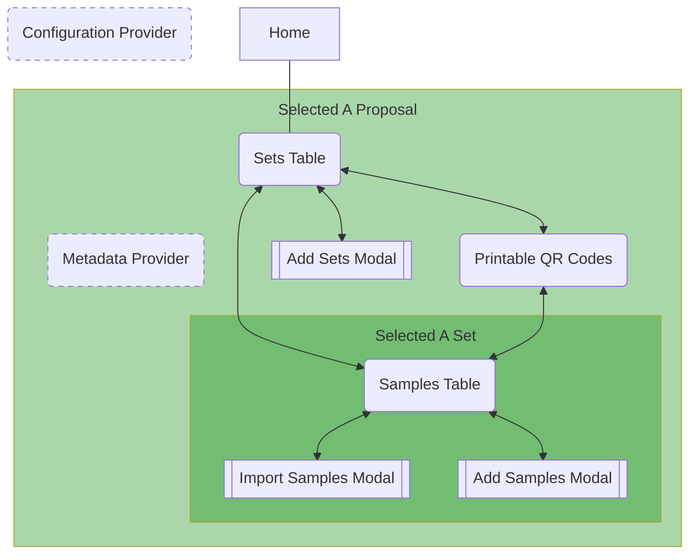

# Beamline Sample Set Configuration app

A browser application for quickly creating and submitting sets of sample metadata, including per-set QR codes that will become physical labels printed and attached to sample carriers.

The design document <a href="https://github.com/als-computing/software_requirements/blob/main/docs/sample_metadata_input_app/index.md">can be found here.</a>


# Local development

This app is based on the Vite React+TypeScript template.  To get started developing, check out this repo and `cd` into it, then:

```
npm install
npm run dev
```
Open a browser and go to `http://localhost:8080/` to see the app running.

This is a client-side browser app, which depends on a <a href="https://github.com/SciCatProject">SciCat</a> instance to store data, so he first thing it's likely to do is complain that it can't connect to a database.

The quickest way to get SciCat running locally is to check out and launch the <a href="https://github.com/SciCatProject/scicatlive">SciCatLive</a> project.  This project has default settings in `public/config.json` that will try to connect to a server at `http://backend.localhost/`, which is where SciCatLive makes itself available.

# Docker development

A `Dockerfile` is included that builds the app and copies it into an nginx image with port `80` exposed, for use in in Docker and Kubernetes.

You can launch the image in a container locally with the `docker-compose.yaml` file, though keep in mind you still need an instance of SciCat to provide storage.

# Deployment

The **als-computing** group maintains a separate repository of helm charts, and this application is included.

# Structure of this app

Pages implemented by this app:



The content of `src` is laid out roughly the same as the subgroups in the chart above, so there is a `proposal` folder with a `set` folder inside it.

Note the presence of *Configuration Provider* and *Metadata Provider*.  These are React <a href="https://react.dev/learn/passing-data-deeply-with-context">Context Providers</a> that become active at certain levels of the page heirarchy.

* **Configuration Provider** (`appConfigurationProvider.tsx`) fetches and parses the `config.json` file and turns it into an object, and makes it available to every page, including the home page.

* **Metadata Provider** (`metadataProvider.tsx`) becomes active when a proposal is selected, and fetches all the sample configuration data for that proposal from SciCat, and makes it available to every page involving a proposal.

## Reusable components

The `components` folder contains a handful of UI components that are self-contained enough to be reusable.

These may at some point be broken out into a general component repository.


#### `qrCodeImage.tsx`


#### `inputEditable.tsx`


#### `inputAutocomplete.tsx`


#### `loadingBanner.tsx`


